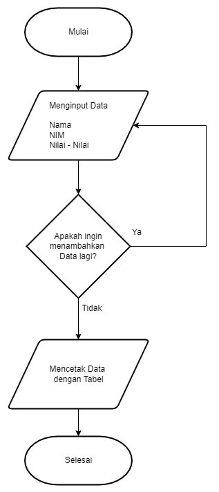
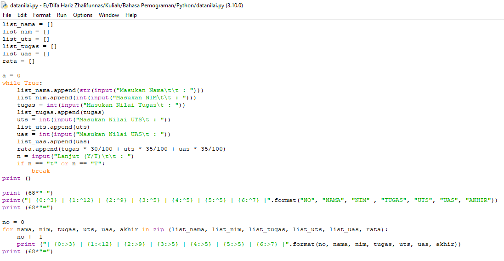
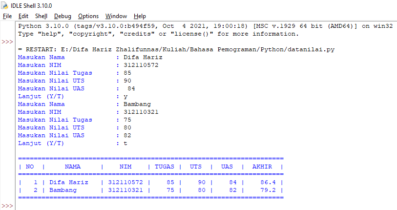

# Tugas-P09
## Tugas Praktikum - Pertemuan 9
## Materi List, Tuple, dan Dictionary

**Ini adalah flowchart dari program yang akan saya buat.**

**Dibawah ini adalah code saya**

**Berikut adalah output dari code di atas.**
**Dengan input data diri dan nilai-nilai.**

